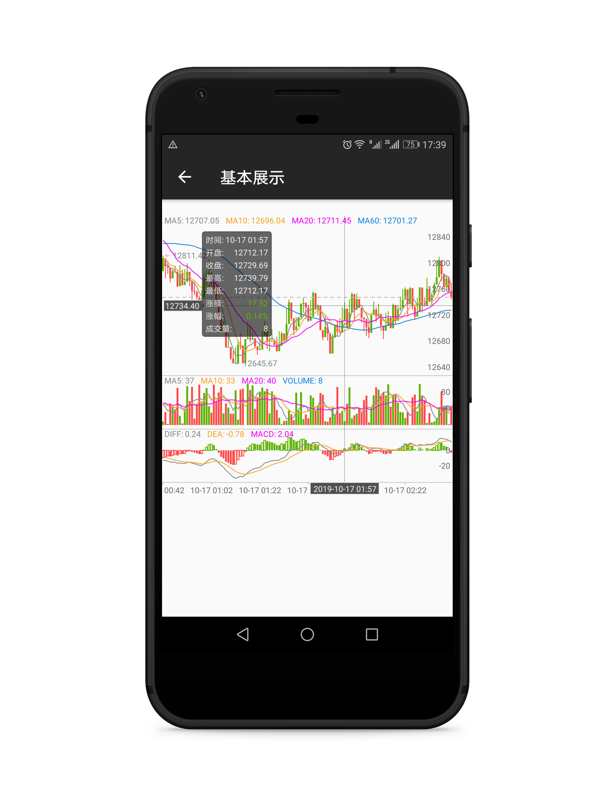
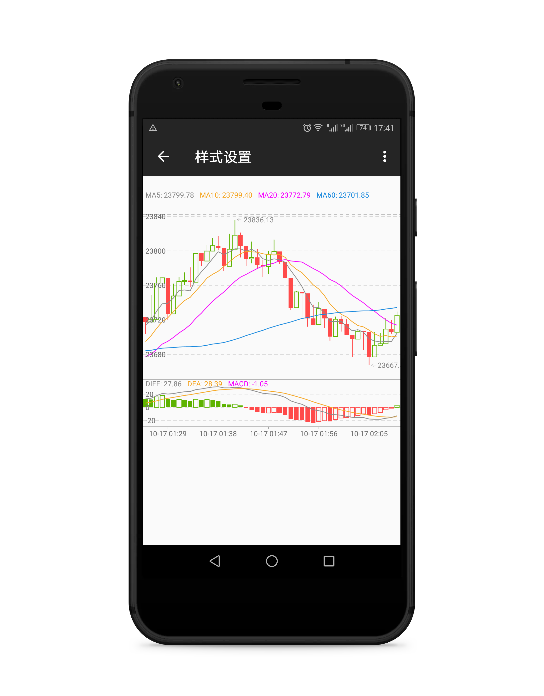
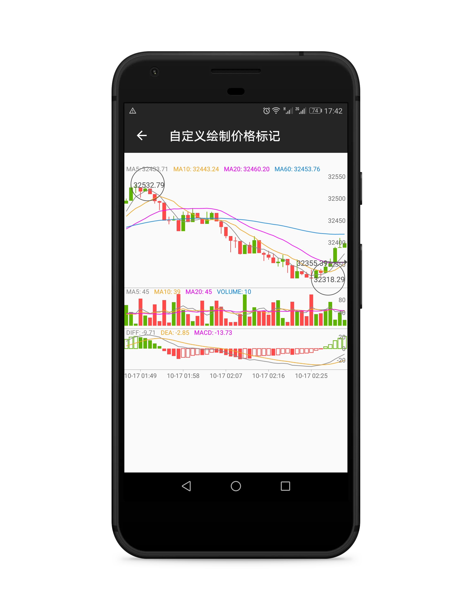
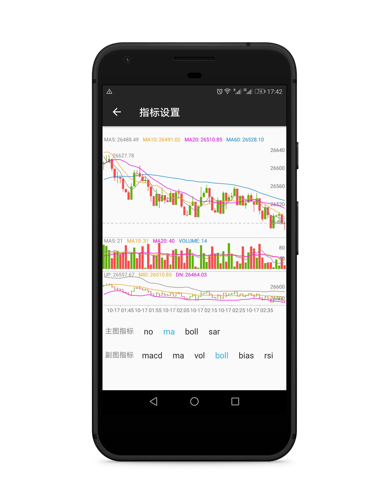
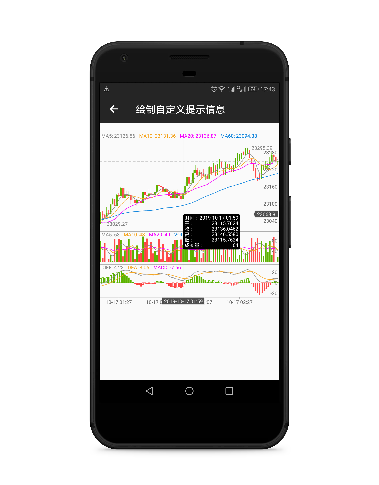
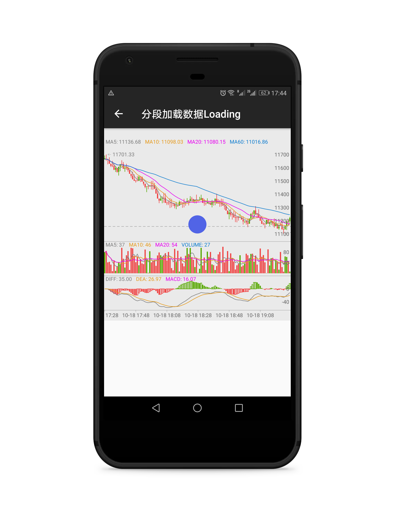

# KLineChart[（中文）](./translate/zh-CN.md)
[](https://travis-ci.org/liihuu/kline)
[](https://www.codacy.com/app/liihuu/kline?utm_source=github.com&amp;utm_medium=referral&amp;utm_content=liihuu/kline&amp;utm_campaign=Badge_Grade)
[](https://github.com/liihuu/kline)
[ ](https://bintray.com/liiiiiihu/maven/klinechart/2.2.3/link)
[](./LICENSE)

A kline UI widget for android. Support analysis indicators and style changes, as well as customize the drawing of something you want to display.

## Usage
Put a widget in the XML layout, set some attributes
```xml
<com.liihuu.klinechart.KLineChartView
    android:id="@+id/k_line_chart"
    android:layout_width="match_parent"
    android:layout_height="350dp"
    android:layout_marginTop="20dp"
    app:candle_style="ohlc"/>
```

Add data and set some attributes in the code.

#### Kotlin
```kotlin
k_line_chart.candle.candleStyle = Candle.CandleStyle.OHLC
k_line_chart.addData(dataList)
``` 
#### Java
```java
k_line_chart.getCandle().setCandleStyle(Candle.CandleStyle.OHLC)
k_line_chart.addData(dataList)
```

## Download
### gradle
```groovy
implementation 'com.liihuu.widget:klinechart:2.2.3'
```
### maven
```xml
<dependency>
  <groupId>com.liihuu.widget</groupId>
  <artifactId>klinechart</artifactId>
  <version>2.2.3</version>
  <type>pom</type>
</dependency>
```
## Indicator
### Supported by default
<table>
    <tbody>
        <tr>
            <th>MA</th>
            <th>VOL</th>
            <th>MACD</th>
            <th>BOLL</th>
            <th>KDJ</th>
            <th>KD</th>
            <th>RSI</th>
            <th>BIAS</th>
            <th>BRAR</th>
            <th>CCI</th>
        </tr>
        <tr>
            <th>✅</th>
            <th>✅</th>
            <th>✅</th>
            <th>✅</th>
            <th>✅</th>
            <th>✅</th>
            <th>✅</th>
            <th>✅</th>
            <th>✅</th>
            <th>✅</th>
        </tr>
        <tr>
            <th>DMI</th>
            <th>CR</th>
            <th>PSY</th>
            <th>DMA</th>
            <th>TRIX</th>
            <th>OBV</th>
            <th>VR</th>
            <th>WR</th>
            <th>MTM</th>
            <th>SAR</th>
        </tr>
        <tr>
            <th>✅</th>
            <th>✅</th>
            <th>✅</th>
            <th>✅</th>
            <th>✅</th>
            <th>✅</th>
            <th>✅</th>
            <th>✅</th>
            <th>✅</th>
            <th>✅</th>
        </tr>
    </tbody>
</table>
The main chart supports all technical analysis indicators, generally only set NO, MA, BOLL and SAR. NO means no display.

### Custom indicator
Charts support custom indicator. [You can refer to examples.](./app/src/main/java/com/liihuu/kline/CustomIndicatorActivity.kt)

## Attributes
Attributes can be changed to change the appearance of the chart.
[Here is attributes detail](./ATTRIBUTE-DETAIL.md)

## Screenshot



## Examples
  + [examples apk](./apk/release/app-release.apk)
  + [style setting](./app/src/main/java/com/liihuu/kline/StyleSettingActivity.kt)
  + [custom draw price mark](./app/src/main/java/com/liihuu/kline/DrawPriceMarkActivity.kt)
  + [indicator setting](./app/src/main/java/com/liihuu/kline/IndicatorSettingActivity.kt)
  + [custom indicator](./app/src/main/java/com/liihuu/kline/CustomIndicatorActivity.kt)
  + [custom draw tooltip general data](./app/src/main/java/com/liihuu/kline/DrawTooltipGeneralDataActivity.kt)
  + [custom tooltip general data](./app/src/main/java/com/liihuu/kline/CustomTooltipGeneralDataActivity.kt)
  + [value format](./app/src/main/java/com/liihuu/kline/ValueFormatActivity.kt)
  + [segmented loading data](./app/src/main/java/com/liihuu/kline/SegmentLoadDataActivity.kt)
  + [segmented loading data with animation](./app/src/main/java/com/liihuu/kline/SegmentLoadDataWithAnimActivity.kt)
  + [filling data](./app/src/main/java/com/liihuu/kline/FillDataActivity.kt)
  + [scrolling](./app/src/main/java/com/liihuu/kline/ScrollingActivity.kt)


## Thanks
  + [MPAndroidChart](https://github.com/PhilJay/MPAndroidChart)

## License
Copyright (c) 2019 lihu

Permission is hereby granted, free of charge, to any person obtaining a copy
of this software and associated documentation files (the "Software"), to deal
in the Software without restriction, including without limitation the rights
to use, copy, modify, merge, publish, distribute, sublicense, and/or sell
copies of the Software, and to permit persons to whom the Software is
furnished to do so, subject to the following conditions:

The above copyright notice and this permission notice shall be included in all
copies or substantial portions of the Software.

THE SOFTWARE IS PROVIDED "AS IS", WITHOUT WARRANTY OF ANY KIND, EXPRESS OR
IMPLIED, INCLUDING BUT NOT LIMITED TO THE WARRANTIES OF MERCHANTABILITY,
FITNESS FOR A PARTICULAR PURPOSE AND NONINFRINGEMENT. IN NO EVENT SHALL THE
AUTHORS OR COPYRIGHT HOLDERS BE LIABLE FOR ANY CLAIM, DAMAGES OR OTHER
LIABILITY, WHETHER IN AN ACTION OF CONTRACT, TORT OR OTHERWISE, ARISING FROM,
OUT OF OR IN CONNECTION WITH THE SOFTWARE OR THE USE OR OTHER DEALINGS IN THE
SOFTWARE.
